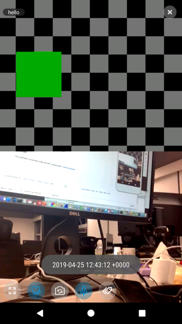

# OpenLive for Android

*其他语言版本： [简体中文](README.zh.md)*

This tutorial describes how to use video tags to deliver metadata/message via video frame.

With this sample app, you can:

- Join a channel
- Use Video Tags to deliver message to other device via video frame



## Running the App
**First**, create a developer account at [Agora.io](https://dashboard.agora.io/signin/), and obtain an App ID. Update "app/src/main/res/values/strings_config.xml" with your App ID.

```
<string name="private_app_id"><#YOUR APP ID#></string>
```

**Next**, integrate the Agora Video SDK and there are two ways to integrate:

- The recommended way to integrate:

Add the address which can integrate the Agora Video SDK automatically through JCenter in the property of the dependence of the "app/build.gradle":
```
implementation 'io.agora.rtc:full-sdk:2.4.0'
```
(Adding the link address is the most important step if you want to integrate the Agora Video SDK in your own application.)

- Alternative way to integrate:

First, download the **Agora Video SDK** from [Agora.io SDK](https://www.agora.io/en/download/). Unzip the downloaded SDK package and copy ***.jar** under **libs** to **app/libs**, **arm64-v8a**/**x86**/**armeabi-v7a** under **libs** to **app/src/main/jniLibs**.

Then, add the following code in the property of the dependence of the "app/build.gradle":

```
compile fileTree(dir: 'libs', include: ['*.jar'])
```

**Finally**, open project with Android Studio, connect your Android device, build and run.

Or use `Gradle` to build and run.

## Developer Environment Requirements
- Android Studio 3.0 or above
- Real devices (Nexus 5X or other devices)
- Some simulators are function missing or have performance issue, so real device is the best choice

## Connect Us
- You can find full API document at [Document Center](https://docs.agora.io/en/)
- You can file bugs about this demo at [issue](https://github.com/AgoraIO/Advanced-Interactive-Broadcasting/issues)

## License
The MIT License (MIT).
